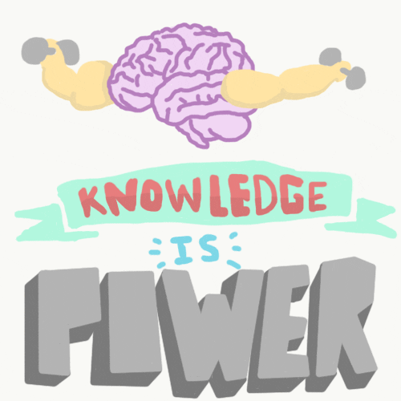

## 🔥Welcome to my README🔥
My name is Osasere Asemota i am a CIS: Information Tech major, Github is really new to me but i usually get the hang of things pretty quick. This i will upload some of my class projects from past semesters and add my own intrest to give an idea into my personality and life. i love evrything tech, nerdy games like yugioh and anime(one piece profile pic) to rap music and R&B. Everyday i try to find something new to learn or build on that what gives me dopamine so i hope you enjoy my page and we both can build great learning experiences.
+ 😏 Linux Administration
+ 💻 Computer languages: C, Python
+ 🛜 Networking
+ 🎵 Music recommendations: Isiah Falls, Smino, Samara Cyn
+ ⛽ Anime recommendations: DandaDan, One Piece, JJK

<!--
**osasereasemota99-design/osasereasemota99-design** is a ✨ _special_ ✨ repository because its `README.md` (this file) appears on your GitHub profile.

Here are some ideas to get you started:

- 🔭 I’m currently working on ...
- 🌱 I’m currently learning ...
- 👯 I’m looking to collaborate on ...
- 🤔 I’m looking for help with ...
- 💬 Ask me about ...
- 📫 How to reach me: ...
- 😄 Pronouns: ...
- ⚡ Fun fact: ...
-->
